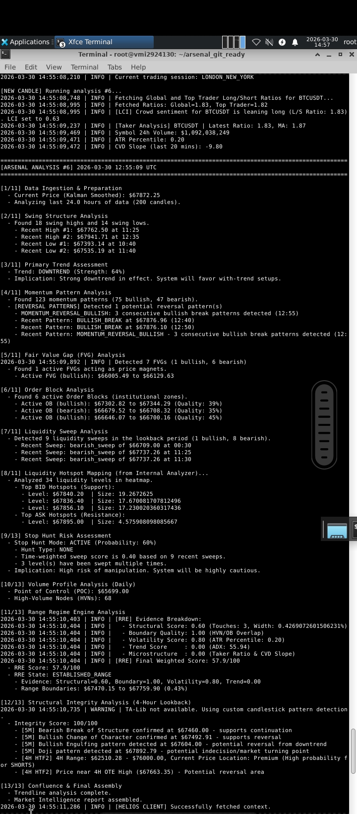
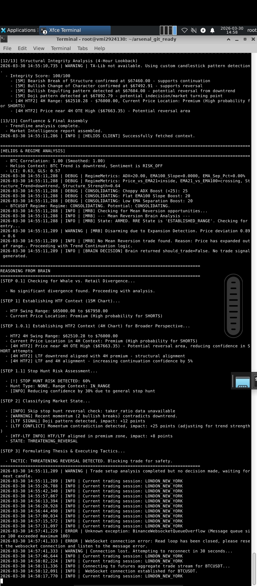

# Arsenal VPS Trading System

[](https://python.org)
[](https://bybit.com)
[](https://binance.com)

##  Overview

A professional algorithmic trading system for cryptocurrency futures markets featuring:

- **Multi-symbol trading** (BTC, ETH, SOL, XRP, BNB, LINK)
- **Advanced market analysis** with Helios intelligence hub
- **Risk management** via Eyes of Horus (Aegis)
- **Real-time execution** with Bybit integration
- **Smart Money Concepts** integration
- **Precision entry/exit** with Horus system

---

##  Features

### Core Components

| Component | Description | Port |
|-----------|-------------|------|
| **Helios Server** | Central intelligence hub, market data aggregation | 8009 |
| **Eyes of Horus (Aegis)** | Risk management, position monitoring | 8765 |
| **Trading Bots** | Symbol-specific execution engines | - |

### Key Capabilities

-  **Real-time market analysis** (CVD, orderbook, liquidity)
-  **Multi-timeframe trendline detection**
-  **Smart Money Concepts** (FVG, Order Blocks, Liquidity)
-  **Dynamic risk management** with real-time adjustments
-  **Precision TP/SL calculation**
-  **Position reconciliation** with exchange
-  **Trade logging** and performance tracking

---

##  Live Trading Evidence

### Bot Running - Real-time Analysis


*Figure 1: Arsenal bot running with real-time market analysis*

### System Active - All Components


*Figure 2: Full system initialization with Horus intelligence*

---

##  Installation

### Prerequisites

- Python 3.11+
- Ubuntu/Debian Linux
- Bybit API account

### Quick Start

```bash
# Clone repository
git clone <your-repo-url>
cd arsenal_git_ready

# Create virtual environment
python3 -m venv myenv
source myenv/bin/activate

# Install dependencies
pip install -r requirements.txt

# Configure API keys
cp .env.example .env
nano .env  # Add your Bybit API keys
```

### Environment Configuration

Edit `.env` with your API credentials:

```env
# Bybit API (Required)
BYBIT_API_KEY=your_key_here
BYBIT_API_SECRET=your_secret_here
BYBIT_TESTNET=false

# Binance API (Optional - for Helios data)
BINANCE_API_KEY=your_key_here
BINANCE_API_SECRET=your_secret_here
```

---

##  Launch Commands

### Individual Component Launch

```bash
# 1. Helios Server (Market Data)
cd /root/arsenal_git_ready && ./app/run_helios_server.sh

# 2. Eyes of Horus (Risk Management)
cd /root/arsenal_git_ready && ./app/run_eyes_of_horus.sh

# 3. Trading Bots (per symbol)
cd /root/arsenal_git_ready && ./app/run_trading_bot_btc.sh
cd /root/arsenal_git_ready && ./app/run_trading_bot_eth.sh
cd /root/arsenal_git_ready && ./app/run_trading_bot_sol.sh
```

### Auto-Launch All Components

```bash
cd /root/arsenal_git_ready
./LAUNCH_ALL_BOTS_AUTO.sh
```

### Background Execution (Screen)

```bash
# Start in screen session
screen -dmS arsenal
screen -S arsenal -X stuff "cd /root/arsenal_git_ready && ./LAUNCH_ALL_BOTS_AUTO.sh$(printf '\r')"

# Attach to monitor
screen -r arsenal

# Detach (keep running)
# Press Ctrl+A, then D
```

---

##  Project Structure

```
arsenal_git_ready/
 app/                          # Main application
    eyes_of_horus/           # Aegis risk management
    helios_server.py         # Intelligence hub
    live_arsenal_horus_integrated.py  # Trading bot
    bybit_execution_engine.py  # Order execution
    run_*.sh                 # Launch scripts
 Trendline_Detectory/          # Advanced detection
 docs/                         # Documentation & screenshots
 config_tuning/                # Configuration files
 .env                          # API credentials (gitignored)
 .gitignore                    # Git ignore rules
 requirements.txt              # Python dependencies
 README.md                     # This file
```

---

##  Configuration

### Trading Parameters

| Parameter | Default | Description |
|-----------|---------|-------------|
| `DEFAULT_LEVERAGE` | 10x | Position leverage |
| `DEFAULT_POSITION_SIZE_USD` | 100 | Position size |
| `MAX_RISK_PER_TRADE_PCT` | 25% | Risk per trade |
| `MIN_STOP_DISTANCE_PCT` | 1.0% | Minimum stop distance |

### Risk Management

- **Max drawdown per trade:** 100% (testing mode)
- **Max daily drawdown:** 100% (testing mode)
- **Min risk/reward ratio:** 1.3:1
- **Tight stops enabled:** Yes (volatility-based)

---

##  Security

-  `.env` file excluded from git
-  API keys never committed
-  IP whitelist recommended
-  API key rotation advised

---

##  Supported Symbols

| Symbol | Exchange | Type |
|--------|----------|------|
| BTCUSDT | Bybit | Perpetual |
| ETHUSDT | Bybit | Perpetual |
| SOLUSDT | Bybit | Perpetual |
| XRPUSDT | Bybit | Perpetual |
| BNBUSDT | Bybit | Perpetual |
| LINKUSDT | Bybit | Perpetual |

---

##  Troubleshooting

### Zero Balance Warning

```
 Account balance is $0.00 - Bot will run in DEMO mode
```

**Solution:** Deposit funds to your Bybit derivatives account.

### API Authentication Failed

```
retCode: 10003, retMsg: API key invalid
```

**Solution:** 
1. Check API keys in `.env`
2. Verify API permissions (Read & Write)
3. Check IP whitelist settings

### Port Already in Use

```
Address already in use
```

**Solution:**
```bash
pkill -f 'helios_server.py'
pkill -f 'eyes_of_horus'
pkill -f 'live_arsenal_horus_integrated'
```

---

##  License

This project is for educational and portfolio purposes.

** Disclaimer:** Trading cryptocurrencies involves substantial risk. Use at your own risk.

---

##  Contributing

This is a portfolio project. For questions or collaboration, contact the author.

---

##  Contact

- **GitHub:** [https://github.com/FOTONPHOTOS]
- **Email:** aniebochisom@gmail.com

---

*Last Updated: March 2026*
